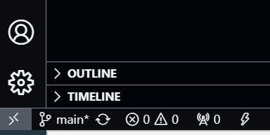
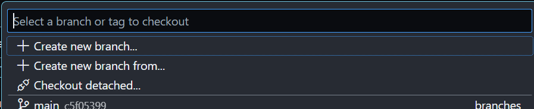
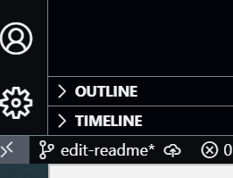
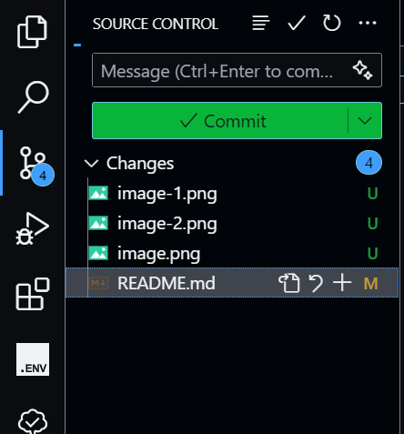
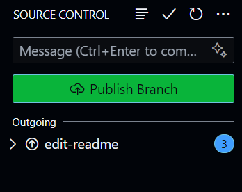
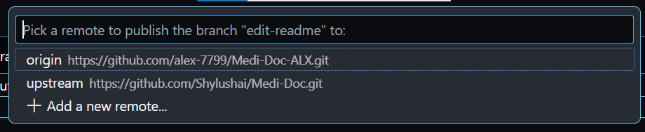

## How to Run
- Fork this repo in Github & Clone your fork to your local machine (use Github Desktop)
- Contact Noah for amplify_outputs.json (Back-end configs file)
- Put the file at the root of the repo folder
- Install Node.JS & restart your machine
- Open the repo folder in VS Code
- Run the following command in terminal (Ctrl + `) line-by-line:

npm install

npm run dev

- It should print a localhost address if successfully, go to that address to preview the project, any change you make should reflect asap on the preview page

## How to Contribute
- Do **How to Run**
- Before every task, we need to create a new branch so that any changes we make will not affect other branches until it is merged to main branch

In VS Code: Ctrl + Shift + P
- Enter & Select: >Git: Create Branch...
OR just use VS Code GUI (at the bottom left corner) -> Click main -> Create new branch

- Please check if the branch is changed to the new branch

- Enter branch name, usually the branch name is related to what changes you will make. Ex: add-patient-login
 
 - Start Coding
 - After finished, we will push our changes to the repo so the maintainer can merge our changes to main branch
 - The easiest way is to use VS Code Source Control:
 
 - Open VS Code Source Control
 
 - Enter a short description about the changes in the Message box. Ex: add patient login page
 - Press Commit -> Yes
 - Commit is like create a save point for your code, you can cancel or revert your code back to a commit's state (google it)
 - Usually when working, a good habit it to create many commit after milestones or before trying something so we kind of have a back up
 - When ready, press Publish Branch
 
 - Choose upstream to commit to Noah's repo
 
 OR Origin to commit to your fork, normal we will just publish to both
 
 - Contact maintainer to review and merge

**Original Readme Content**
## AWS Amplify React+Vite Starter Template

This repository provides a starter template for creating applications using React+Vite and AWS Amplify, emphasizing easy setup for authentication, API, and database capabilities.

## Overview

This template equips you with a foundational React application integrated with AWS Amplify, streamlined for scalability and performance. It is ideal for developers looking to jumpstart their project with pre-configured AWS services like Cognito, AppSync, and DynamoDB.

## Features

- **Authentication**: Setup with Amazon Cognito for secure user authentication.
- **API**: Ready-to-use GraphQL endpoint with AWS AppSync.
- **Database**: Real-time database powered by Amazon DynamoDB.

## Deploying to AWS

For detailed instructions on deploying your application, refer to the [deployment section](https://docs.amplify.aws/react/start/quickstart/#deploy-a-fullstack-app-to-aws) of our documentation.

## Security

See [CONTRIBUTING](CONTRIBUTING.md#security-issue-notifications) for more information.

## License

This library is licensed under the MIT-0 License. See the LICENSE file.